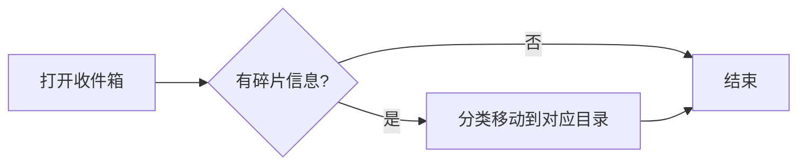
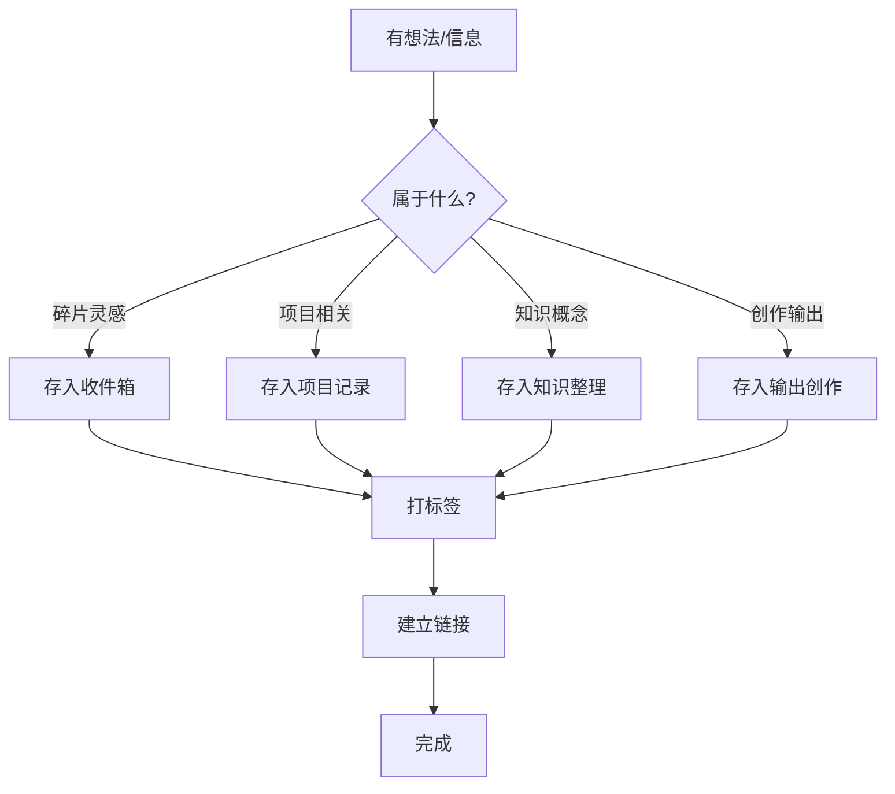

# 维护SOP

个人知识库的日常维护标准操作流程。

## 日常维护

### 每日（5分钟）



1. **清空收件箱**：将碎片信息移到对应目录
2. **记录灵感**：随手记录新想法到 `04-输出创作/灵感碎片/`
3. **更新进度**：如果当日有项目进展，更新项目笔记

### 每周（30分钟）

1. **周复盘**：
   - 新建 `05-复盘归档/周复盘/YYYY-WW_周复盘.md`
   - 回顾本周做了哪些事
   - 记录学到的经验
   - 规划下周重点

2. **整理信息输入**：
   - 将本周收集的信息分类到子目录
   - 标记待读文章为 `#status/待读`
   - 删除无价值的内容

3. **梳理知识库**：
   - 补充新的 [[双向链接]]
   - 找出孤立的笔记并建立连接
   - 删除或合并重复笔记

### 每月（2小时）

1. **月复盘**：
   - 基于4份周复盘，总结月度收获
   - 评估目标的完成进度
   - 调整下月方向

2. **标签审计**：
   - 检查标签使用情况：[标签管理](#标签管理)
   - 合并或删除废弃标签
   - 补充新标签

3. **常青笔记更新**：
   - 审查常青笔记是否需要更新
   - 补充新的见解和经验

### 每季度（半天）

1. **季度复盘**：
   - 审视知识体系结构
   - 调整分类体系
   - 评估工具链效率

2. **深度清理**：
   - 归档旧笔记（超过1年无更新的）
   - 彻底删除无价值内容
   - 整理附件目录

3. **升级模板**：
   - 根据使用体验优化模板
   - 更新自动化脚本

### 每年（一天）

1. **年度复盘**：
   - 全面回顾一年的知识积累
   - 统计笔记数量、链接数量
   - 制定下一年计划

2. **体系优化**：
   - 重新审视整个目录结构
   - 优化分类体系
   - 更新维护SOP

## 具体操作流程

### 新增一条笔记



1. 判断笔记类型
2. 存入对应目录
3. 打上适当的标签（至少一个类型标签 + 一个领域标签）
4. 检查是否有相关的已有笔记，添加 [[双向链接]]
5. 更新索引

### 处理收件箱

1. 打开 `01-信息输入/收件箱/`
2. 逐条检查：

   | 内容类型 | 处理方式 |
   |----------|----------|
   | 有价值的信息 | 分类移动到 `01-信息输入/` 对应子目录 |
   | 需要深入了解 | 转存到 `03-知识整理/待处理/` |
   | 灵感创意 | 转存到 `04-输出创作/灵感碎片/` |
   | 无价值 | 直接删除 |

3. 清空收件箱（0条目）

### 写一篇阅读笔记

1. 从 `01-信息输入/阅读笔记/` 中找到读书标注
2. 提炼核心观点
3. 用自己的话重述
4. 连接已有知识
5. 保存为 `01-信息输入/阅读笔记/书名_笔记.md`

格式模板：

```markdown
# 《书名》阅读笔记

## 基本信息
- 作者：xxx
- 读完日期：YYYY-MM-DD
- 评分：⭐⭐⭐⭐

## 核心观点
1. ...
2. ...
3. ...

## 我的理解
...

## 与已有知识的联系
- 与 [[另一篇笔记]] 相关
- 与 [[思维模型]] 相似

## 行动清单
- [ ] ...
```

## 标签管理

### 新标签申请流程

1. 检查是否已有同义标签
2. 确认标签符合命名规范
3. 添加到本文档的 [知识分类体系.md](./知识分类体系.md)
4. 更新索引

### 标签清理操作

```python
# tags_cleanup.py - 标签清理脚本
import re
from pathlib import Path

def find_all_tags(directory: str) -> dict:
    """扫描所有笔记中的标签"""
    tags = {}
    for f in Path(directory).rglob("*.md"):
        content = f.read_text()
        found = re.findall(r"#[a-zA-Z\u4e00-\u9fff/]+", content)
        for tag in found:
            if tag not in tags:
                tags[tag] = []
            tags[tag].append(str(f))
    return tags

def merge_tags(old_tag: str, new_tag: str, directory: str):
    """合并标签"""
    for f in Path(directory).rglob("*.md"):
        content = f.read_text()
        content = content.replace(old_tag, new_tag)
        f.write_text(content)

def remove_tag(tag: str, directory: str):
    """删除标签"""
    for f in Path(directory).rglob("*.md"):
        content = f.read_text()
        content = content.replace(tag, "")
        f.write_text(content)
```

## 常见问题

### 笔记应该放在哪里？

**黄金法则：** 如果无法确定放哪里，先放收件箱。等整理时再分类。

### 需要很精确的分类吗？

不需要。分类的目的是**方便找到**，不是追求精确。如果一篇笔记可以归入多个分类，选最相关的那个，然后用标签补充其他维度。

### 多久更新一次常青笔记？

常青笔记应该是**持续更新**的。当有新的认知时，随时补充；做月复盘时统一审查一次。

### 如何避免知识库变成垃圾堆？

严格执行"定期清理"环节：
- 每月清理一次
- 无价值的内容果断删除
- 过时的内容及时归档
- 重复的内容合并归一

## 自动化建议

使用 [Obsidian自动化脚本库](https://github.com/yourname/Obsidian自动化脚本库) 的脚本：

```bash
# 自动整理未归类笔记
python organize.py --source ./01-信息输入/收件箱/

# 自动更新索引
python update_index.py

# 自动清理过期内容（30天未更新的草稿）
python cleanup.py --days 30

# 自动备份
python backup.py --destination /path/to/backup/
```

## 版本记录

| 版本 | 日期 | 更新内容 |
|------|------|----------|
| v1.0 | 2025-01-01 | 初始版本 |
| v1.1 | 2025-03-15 | 增加标签管理流程 |
| v1.2 | 2025-06-01 | 优化分类体系 |